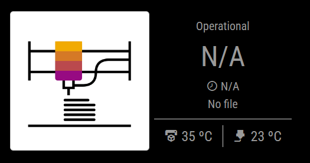

# MMM-printerMonitor



`MMM-printerMonitor` is a MagicMirror module that monitors the status of a 3D printer using data from an OctoPrint server. It displays information such as the printer's state, progress, remaining time, and temperatures, along with a live video stream or a placeholder image when the camera is unavailable.

## Features

- Displays the current state of the 3D printer (e.g., printing, idle, etc.).
- Shows the progress percentage and remaining time for the current print job.
- Displays the name of the file being printed.
- Monitors and displays the bed and ability temperatures.
- Supports live video streaming from the printer's camera.
- Shows a placeholder image or GIF when the camera is unavailable.
- Configurable update intervals and display options.

## Installation

1. Navigate to your MagicMirror `modules` folder:
   ```bash
   cd ~/MagicMirror/modules
   ```

2. Clone this repository:
   ```bash
   git clone https://github.com/VictorPiella/MMM-printerMonitor
   ```

3. Navigate to the module folder:
   ```bash
   cd MMM-printerMonitor
   ```

4. Install the required dependencies:
   ```bash
   npm install
   ```

## Configuration

To use this module, add it to the `modules` array in your `config.js` file:

```javascript
{
    module: "MMM-printerMonitor",
    position: "top_left", // Choose the position on the MagicMirror
    config: {
        url: "http://<OCTOPR_SERVER_IP>:<PORT>", OctoPrint server URL
        api_key: "<YOUR_API>", // OctoPrint API key
        showStream: true, // Enable or disable the video stream
        streamUrl: "http://<OCTOPR_SERVER_IP>:<PORT>/cam/?action=stream", // Webcam stream URL
        showPreview: true, // Enable or disable the preview image
        previewUrl: "http://<OCTOPR_SERVER_IP>:<PORT>/.jpg", // Preview image URL
        maxStreamWidth: 400, // Maximum width for the video stream
        maxStreamHeight: 300, // Maximum height for the video stream
        showTemps: true, // Enable or disable temperature display
        updateInterval: 60000, // Update interval in milliseconds (default: 60 seconds)
        debugMode: false, // Enable or disable debug logs
        hideModuleWhenOffline: false // Hide the module when the printer is offline
    }
}
```

### Configuration Options

| **Option**              | **Type**    | **Default**         | **Description**                                                                 |
|-------------------------|-------------|---------------------|---------------------------------------------------------------------------------|
| `url`                  | `string`    | `""`                | The URL of your OctoPrint server.                                              |
| `api_key`              | `string`    | `""`                | Your OctoPrint API key.                                                        |
| `showStream`           | `boolean`   | `true`              | Enable or disable the live video stream.                                       |
| `streamUrl`            | `string`    | `""`                | The URL for the webcam stream. Dynamically set if not provided.                |
| `showPreview`          | `boolean`   | `true`              | Enable or disable the preview image.                                           |
| `previewUrl`           | `string`    | `""`                | The URL for the preview image.                                                 |
| `maxStreamWidth`       | `number`    | `400`               | Maximum width for the video stream in pixels.                                  |
| `maxStreamHeight`      | `number`    | `300`               | Maximum height for the video stream in pixels.                                 |
| `showTemps`            | `boolean`   | `true`              | Enable or disable the display of bed and ability temperatures.                 |
| `updateInterval`       | `number`    | `60000`             | Interval (in milliseconds) for updating the printer data.                      |
| `debugMode`            | `boolean`   | `false`             | Enable or disable debug logs in the console.                                   |
| `hideModuleWhenOffline`| `boolean`   | `false`             | Hide the module when the printer is offline.                                   |

## Usage

Once configured, the module will display the following information:

- **Printer State:** The current state of the printer (e.g., "Printing", "Idle").
- **Progress:** The percentage of the current print job completed.
- **Remaining Time:** The estimated time left for the print job.
- **File Name:** The name of the file being printed.
- **Bed Temperature:** The current temperature of the printer's bed.
- **Ability Temperature:** The current temperature of the printer's ability (nozzle).
- **Video Stream:** A live video stream of the printer, or a placeholder image/GIF if the camera is unavailable.

### Example Output

```
[Printer State] Printing
[Progress] 31%
[Remaining Time] 00:58:55
[File Name] example.gcode
[Bed Temp] 50°C
[Ability Temp] 200°C
```


## Thumbnails

To display a thumbnail you have to install the [Slicer Thumbnails](https://plugins.octoprint.org/plugins/prusaslicerthumbnails/) plugin.

## Dependencies

- [Node.js](https://nodejs.org/) (v12 or higher)
- [OctoPrint API](https://docs.octoprint.org/en/master/api/)
- [Slicer Thumbnails](https://plugins.octoprint.org/plugins/prusaslicerthumbnails/)

## Troubleshooting

- **No data displayed:** Ensure the `url` and `api_key` in the configuration are correct.
- **Video stream not working:** Check the `streamUrl` and ensure the webcam is properly configured in OctoPrint.
- **Debugging:** Set `debugMode: true` in the configuration to see detailed logs in the browser console.

## License

This project is licensed under the MIT License. See the [LICENSE](LICENSE) file for details.

## Acknowledgments

- [MagicMirror²](https://magicmirror.builders/) for the platform.
- [OctoPrint](https://octoprint.org/) for the 3D printer monitoring API.
- [Material Design Icons](https://materialdesignicons.com/) for the icons used in the module.
